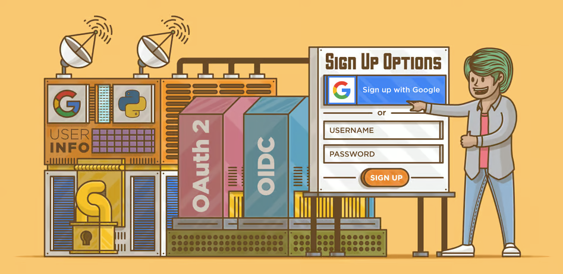

# User Login and Registration with Flask and Google OAuth 2.0

This is a simple web application built with Flask that allows users to log in and register using their Google accounts through OAuth 2.0 authentication.




## Project Overview

In this project, we leverage Flask web framework and Google OAuth 2.0 to enable users to log in and register with their Google accounts. The application demonstrates a basic user authentication system that redirects users to Google's authentication page for login and retrieves user information upon successful authentication. 

## Getting Started

To run the project locally, follow the steps below:

1. Clone the repository to your local machine:


```
git clone https://github.com/miracyuzakli/User-Login-and-Registration-with-Flask-and-Google-OAuth-2.0
```

2. Install the required packages using `pip`:

```
pip install -r requirements.txt

```


3. Set up Google OAuth Credentials:
- Go to the [Google Developers Console](https://console.developers.google.com/) and create a new project.
- Create OAuth 2.0 credentials (Web Application type) and set the appropriate redirect URI for your application.
- Copy the Client ID and Client Secret to the respective variables in `app.py`.

4. Run the application:

```
python app.py

```

5. Access the application in your web browser at `http://localhost:5000/`.

## Features

- User Login: Users can log in using their Google accounts through OAuth 2.0 authentication.
- User Registration: Upon successful authentication, the application retrieves user information (e.g., name, email) from Google and displays it on the home page.

## File Structure


```
user-login-registration-flask-google-oauth/
│
├── app.py # Main Flask application file
├── requirements.txt # List of required packages
└── .gitignore # Files and directories to be ignored by Git
```


## Dependencies

- Flask==2.0.1
- Flask-OAuthlib==0.9.7
- requests==2.26.0

## Contributing

If you'd like to contribute to this project, you can:

- Report issues or bugs
- Suggest new features or improvements
- Submit pull requests

We welcome contributions from the community! For major changes, please open an issue first to discuss what you would like to change.

## License

This project is licensed under the [MIT License](LICENSE).
